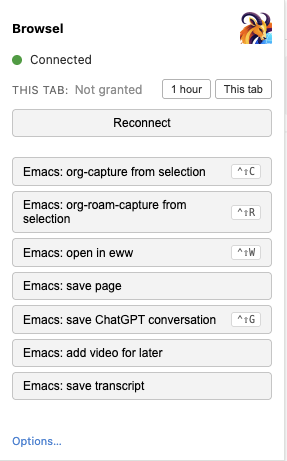

#+title: chrome-server
#+author: Daniel M. German

=chrome-server= is a module that allows Emacs and Chrome to
communicate with each other, in both directions.  Right-click on a
page in Chrome and have it sent to Emacs (org-capture, save-page,
archive a ChatGPT conversation, save a YouTube video for later).
Going the other way: from Emacs ask the browser things (what tabs
are open?  what's the page title?  what's the video's current time?)
and act on them.

=chrome-server= is composed of two parts:

1. *An Emacs side*.  A WebSocket server on =127.0.0.1:9130= that
   registers handlers for actions initiated from Chrome, plus an
   elisp API for actions Emacs initiates.
2. *A Chrome extension*.  An MV3 extension that connects to the
   Emacs server, registers the right-click menu items, owns the
   toolbar icon and the popup, and routes requests in both
   directions.

Both must be running.  The Chrome extension auto-reconnects, so
restarting Emacs is non-disruptive — the popup transitions from
Connected to Connecting and back.  Setup for each side is below.

For implementation details — adding new actions, the wire protocol,
the JSON schemas — see =CONTRIBUTING.org=.

* Features

** In Chrome

- Right-click menu items that trigger Emacs actions: org-capture,
  org-roam-capture, open-in-eww, save-page, save-chatgpt,
  add-youtube-video, save-youtube-transcript.
- Configurable keyboard shortcuts for the same actions.
- A toolbar popup with live connection status, per-tab permission
  controls, one-click buttons for every action, and a jump list of
  tabs that have granted JS-eval permission.
- Per-tab consent gating arbitrary JavaScript evaluation, indicated
  by an in-page overlay and a red toolbar icon while active.

** In Emacs

- Org-Babel =chrome-js= source blocks that run JavaScript in the
  active tab and return the value into the org buffer.
- An elisp API to query and steer the browser: list tabs, focus,
  open, close, evaluate JS with a return value.

** Extensibility

- A new action is a single =config.json= edit plus =make build=; no
  Chrome extension code change is required.

* Right-click menu actions

| Menu item                              | Where it shows               | What it does                                       |
|----------------------------------------+------------------------------+----------------------------------------------------|
| Emacs: org-capture from selection      | right-click on selected text | opens =org-capture= seeded with the selection      |
| Emacs: org-roam-capture from selection | right-click on selected text | opens =org-roam-capture=                            |
| Emacs: open in eww                     | any page or link             | opens the URL in =eww= inside Emacs                |
| Emacs: save page                       | any page                     | archives the main content as an org file           |
| Emacs: save ChatGPT conversation       | chatgpt.com pages            | saves the whole conversation as org                |
| Emacs: add video for later             | YouTube pages / links        | appends a TODO entry with metadata to the videos file |
| Emacs: save transcript                 | YouTube pages / links        | runs =yt-dlp= and writes a clickable-timestamp org |

* Keyboard shortcuts

Bind any of the menu actions at =chrome://extensions/shortcuts=.  A
few defaults are pre-suggested:

- =Ctrl+Shift+C= → org-capture
- =Ctrl+Shift+R= → org-roam-capture
- =Ctrl+Shift+W= → open in eww
- =Ctrl+Shift+G= → save ChatGPT conversation

The remaining commands are declared but unbound — Chrome only honors
four default-bound shortcuts per Chrome extension, so the rest are
yours to assign.

* Per-tab eval consent

The toolbar icon is purple by default.  It turns *red* on tabs that
have granted Emacs permission to evaluate JavaScript on them.  Closing
the tab revokes the grant.

The first =EVAL_IN_ACTIVE_TAB= request on a tab displays an in-page
overlay showing the code about to run, with four buttons: *Deny*,
*Allow once*, *Allow 1 hour*, *Allow this tab*.  30 seconds without
a response counts as deny.

* The popup

#+caption: The Chrome extension popup
#+attr_org: :width 280
#+attr_html: :width 280

- Connection status to Emacs (●  Connected / Connecting… / Disconnected).
- A one-line summary of this tab's eval permission, with buttons to
  grant for 1 hour, grant until tab closes, or revoke.
- A button for each menu action that triggers it without using the
  right-click menu.  The label on the right shows the assigned
  keyboard shortcut, if any.
- A "Tabs with permission" list — every tab where eval rights have
  been granted, with title, time remaining, and a *Revoke* button.
  Click a row to jump to that tab.

* Run JavaScript in any tab from Emacs

Send the browser a JavaScript snippet from an org buffer; get the
value back as the block result:

#+begin_src chrome-js
document.querySelector('video').currentTime
#+end_src

The first time, the page displays a consent overlay — read the code,
click Allow.  Same call from elisp:

#+begin_src emacs-lisp
(chrome-server-request "EVAL_IN_ACTIVE_TAB"
                       '(:code "document.querySelector('video').currentTime"))
#+end_src

* Querying and steering the browser from Emacs

#+begin_src emacs-lisp
;; List every open tab as title/url pairs
(mapcar (lambda (tab) (cons (plist-get tab :title) (plist-get tab :url)))
        (chrome-server-request "GET_ALL_TABS" nil))

;; Jump to a tab by id
(chrome-server-request "FOCUS_TAB" '(:id 1234 :focusWindow t))

;; Open a new tab
(chrome-server-request "OPEN_TAB" '(:url "https://example.com"))
#+end_src

* Setup

** Requirements

Core (always needed):

- Emacs with the =websocket= package available.
- Chrome or Chromium.

Per-feature.  Each row is needed *only* if you actually invoke that
feature; the rest of =chrome-server= keeps working without it.

| Feature                            | Needed                            | What "missing" looks like                                  |
|------------------------------------+-----------------------------------+-------------------------------------------------------------|
| =ORG_ROAM_CAPTURE= action          | =org-roam= package                | Errors when the user picks the org-roam-capture menu item   |
| =SAVE_PAGE= / =CHATGPT=            | =pandoc= on =$PATH=               | Errors at save time; the right-click action fails          |
| =YOUTUBE_TRANSCRIPT=               | =yt-dlp= on =$PATH=               | Errors at fetch time                                        |
| Rich =YOUTUBE= metadata            | YouTube Data API v3 key           | Capture still works, but without title/duration/description |
| Optional Emacs-side modules        | corresponding =(require …)= in the use-package =:config= | Their handlers aren't registered; that name returns "Unknown request" |

If you don't load a module (e.g. don't =(require 'chrome-server-youtube)=),
none of its external dependencies are needed at all.

** Emacs

One =use-package= form for the core, with each optional feature pulled
in by a =require= you can comment out:

#+begin_src emacs-lisp
(use-package websocket :ensure t)

(use-package chrome-server
  :load-path "/path/to/chrome-server"
  :after websocket
  :config
  (require 'chrome-server-www)      ; SAVE_PAGE        (web archive)
  (require 'chrome-server-chatgpt)  ; CHATGPT          (save conversation)
  (require 'chrome-server-youtube)  ; YOUTUBE + YOUTUBE_TRANSCRIPT
  (require 'chrome-server-babel)    ; org-babel chrome-js blocks
  (chrome-server-start))
#+end_src

Drop any =require= line you don't want — =chrome-server.el= itself
registers the three baseline handlers (=ORG_CAPTURE=,
=ORG_ROAM_CAPTURE=, =EWW=) and that's enough for a minimal install.

The server binds =127.0.0.1:9130=.  =(chrome-server-stop)= / =-start=
control it manually.  =(setq chrome-server-debug t)= logs every frame
to =*chrome-server*= when something looks off.

A few variables you'll likely want to set:

| Variable                                | Purpose                                       |
|-----------------------------------------+-----------------------------------------------|
| =chrome-server-www-archive-dir=         | where save-page writes archived pages         |
| =chrome-server-chatgpt-dir=             | where save-chatgpt writes conversations       |
| =chrome-server-youtube-videos-file=     | org file the YouTube capture appends to       |
| =chrome-server-youtube-transcript-dir=  | where transcripts land                        |
| =chrome-server-youtube-api-key=         | YouTube Data API v3 key (for video metadata)  |
| =chrome-server-org-capture-key=         | org-capture template key for browser captures |

The full list is in =CONTRIBUTING.org=.

** Chrome extension

#+begin_src bash
cd extension
make load          # builds, opens chrome://extensions, copies the
                   # build path to your clipboard (macOS)
#+end_src

In Chrome:

1. Turn on Developer mode (top right).
2. Click "Load unpacked", paste the build path (=extension/build/=).
3. Click Details → toggle *Allow User Scripts* on (only needed if you
   want =EVAL_IN_ACTIVE_TAB= / =chrome-js= blocks to work).

The popup should turn green within a few seconds.  If not, click
*Reconnect*.

** Customising

Most things are reachable from the popup → Options page (or
=chrome://extensions= → Chrome Server → Extension options):

- *Raise Emacs* — a checkbox per action.  When checked, Emacs comes to
  the foreground after that action completes.  Lives in browser
  storage, overrides the bundled defaults without rebuilding.
- *Menus* / *Handlers* — raw JSON editors for additions or changes
  beyond the bundled defaults.

Bigger changes (new menus, new content scripts, etc.) live in
=extension/config.json=.  =CONTRIBUTING.org= covers the schema.

* Security

Three independent off-switches in =chrome://extensions=, from
broadest scope to narrowest:

1. *Developer mode* off → the entire Chrome extension stops.  Nothing
   works.
2. *Allow User Scripts* off (per-extension Details toggle) → only JS
   eval is blocked.  Right-click menus, save-page, tab listing all
   keep working.
3. *Per-tab consent prompt* (always on) → the first =chrome-js= eval on
   any new tab shows you the code and asks for permission.  Three
   options: Deny / Allow 1 hour / Allow this tab.  Closing the tab
   revokes consent.

The toolbar icon turns red on tabs you've granted eval permission, and
the popup lists every consented tab so revocation does not require
searching for the tab.

There is no authentication on the WebSocket — anything that can dial
=127.0.0.1:9130= as your user can drive Emacs through =chrome-server=.
That's the same trust boundary as any other local daemon.

For the deeper threat model and what's /not/ protected, see
=CONTRIBUTING.org=.

* Troubleshooting

| Symptom                                   | First thing to try                                                            |
|-------------------------------------------+-------------------------------------------------------------------------------|
| Popup shows Disconnected                  | Click Reconnect.  If still red: reload the Chrome extension card in =chrome://extensions=.  If still red: =M-x chrome-server-start=. |
| =EVAL_IN_ACTIVE_TAB= errors                | Toggle *Allow User Scripts* on in the Chrome extension's Details.             |
| Consent overlay never appears             | =chrome://=, =chrome-extension://=, and the Web Store refuse eval — Chrome policy. |
| "no client connected" from elisp          | Chrome extension isn't connected.  Check the popup; reload if needed.         |
| =chrome-server-start= says "address in use" | Another process is already on 9130.  =lsof -nP -iTCP:9130 -sTCP:LISTEN= to see which. |
| Save-page produces no notification        | Check =*Messages*=; the handler logs success/failure there.                    |

* License

GPL-3.0-or-later.  The full license text is in =LICENSE=
(the canonical FSF GPL v3 text).  Every source file carries an SPDX
identifier; see =CONTRIBUTING.org= if you're adding new files.

* Adding a new action or modifying the protocol

See =CONTRIBUTING.org=.  It covers the full configuration schema, the
JSON shapes Emacs and the browser exchange, the build pipeline, and
how to extend either side.

For weird debugging stories that aren't otherwise documented (MV3
setIcon quirks, IPv6 localhost, lexical-binding + org-capture, YouTube
PoToken gating, …) see =ai/gotchas.md=.
